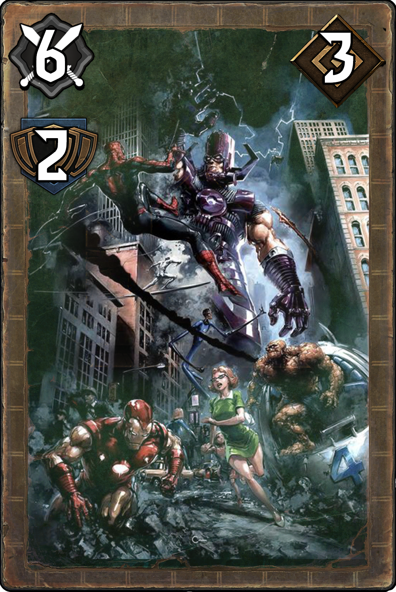
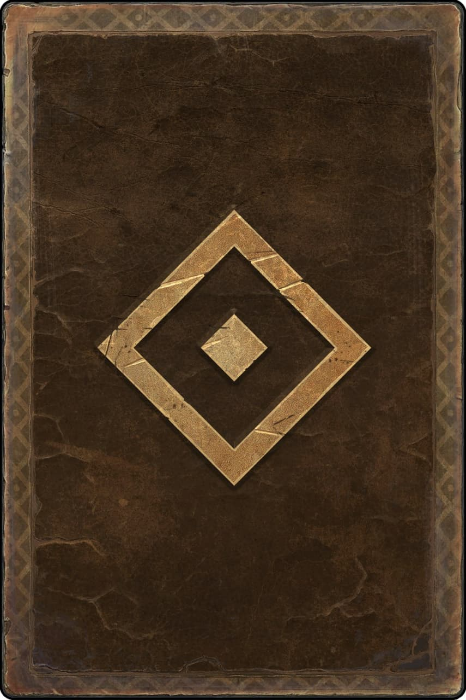

# <p align=center>UCODE-CardGame</p>
<p align=center>Implementation of a card game in a battle variation (Gwent and Hearthstone as references) using PHP/JavaScript/HTML/CSS/MySQL</p>
<p align=center>  </p>

<h1> <p align=center>How to use it?</p> </h1>

1. First of all, start the MySql server typing ```mysql.server restart``` command in your terminal.
2. Next, run the queries located in the ```db.sql``` file from the root directory in the ```mysql``` environment.
3. Open new terminal window and run the ```server.php``` file from the root directory of the project typing ```php server.php```.
4. Now you are ready to host the project - host the ```index.php``` file using ```PHP Server``` extension of ```VS Code``` or any other method.
5. Open second incognito window, copy address from the previously opened tab. Now you are able to examine battle process.

<h1> <p align=center>Card explanation</p> </h1>

Each card has some attributes: attack, defense and its cost.
* The attack attribute, which is situated in the `left top corner` of the card, is the amount of damage that it will deal to the enemy or his/her card.
* Defense is "health" of the card and it is situated just under the attack icon. On the image it is empty, because it is set during the creation using JS to be able to reduce it after damage and display new value.
* Cost, as you can understand, is the value of card and is situated in the `top right corner`. What users will pay for cards will be explained later.
<p align="center"></p>

<h1> <p align=center>What could be done and improved? </h1>

1. At the moment, it is barely impossible to win or lose without surrender as a result of disbalanced cards' price, attack and defense stats. To fix it, individual card abilities should be added, just like in GWENT or Hearthstone. This will give possibility to destroy enemy's cards faster and with less amount of your cards. In addition, the player should be able to choose, what card he/she wants to attack.
2. The game has no penalties for being "AFK", so when the time of round (30 sec) passes, the user that did not make a move should be somehow penaltied.
3. Data that user posseses is connected to the current connection to the server and as it is made at the beginning of the page load, if the user will decide to reload the page, the game will start again for him, but not for his enemy. This is the first thing that has to be fixed.
4. As you noticed, in the main menu you can select a hero (your avatar), but it does not give you some buffs, etc. The idea was to give each hero a special ability, like "Cards defense is increased by 1" or "You can play a random card from your deck". Just like in GWENT.
5. Players should be able to constuct their own decks, so a bigger amount of cards should be done. For this, special tabs in the menu, like "Deck constructor", should be implemented.
